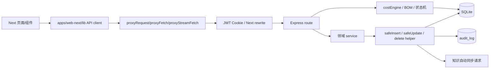
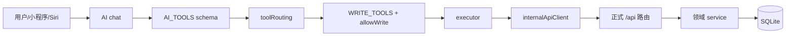
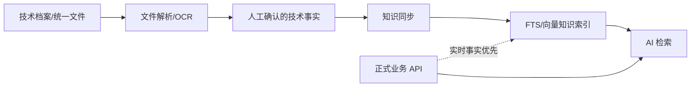

# API 架构审核与解耦报告

> 审核日期：2026-08-03
>
> 审核范围：当前工作区实际代码、HTTP 路由、领域 service、AI tools/executors、SQLite 访问、测试和文档。
>
> 当前基线：214 条 HTTP 路由、85 个正式业务 command/maintenance、65 个 AI 能力、27 个 AI 写工具。

本报告保留审核事实、能力矩阵、依赖、风险和最终整改状态；逐批实施流水已删除，具体过程由 Git 历史和自动化测试记录保存。所有新增和重构 API 的长期强制规则见 [API 统一契约](./api-contract.md)，实施流程见 [API 变更 SOP](./api-sop.md)。

### 当前整改状态（截至 2026-08-03）

- 214 条 Express 路由全部进入当前接口总表；85 个正式业务 command/maintenance、65 个 AI 能力和 27 个 AI 写工具由统一能力注册表治理。
- 高风险写操作已具备按风险分级的 Preview/确认、资源版本、持久幂等、SQLite 事务、operation receipt 和强审计；GET/Query 隐式写入已移除。
- 订单、报价、采购、库存、配方、零件、线圈、客户、模板、成本、设置、转子、文件、知识、质量和关键 AI 跨 API 编排已抽入领域 Query/Command service；路由保留鉴权、参数适配、service 调用和兼容响应。
- AI executor 只通过内部 HTTP client 调用正式 API，不访问数据库或重做成本、库存、订单状态机；工具权限、执行器归属、结果来源和正式能力映射由注册表统一投影。
- `costEngine` 继续是正式成本唯一权威；知识库和 RAG 只提供派生检索与背景，不作为实时库存、价格、成本、报价金额或订单状态来源。
- `voice/asr` 和 `model-variants` 均存在真实调用方，继续兼容保留；历史端点仅在取得调用遥测并完成废弃周期后删除。
- 最终自动验收：聚焦契约 161/161、`npm test` 884/884、`npm run test:deep-api` 296/296、lint 0 error（15 条既有前端 warning）、生产构建成功。正式数据库只读检查为 migration 44、`integrity_check=ok`、外键违规 0、`api_operations=0`；能力映射缺失、协议缺口、普通业务路由直接写入和 executor 数据库旁路均为 0。

## 1. 结论摘要

当前系统已经具备可继续演进的模块化单体基础：SQLite + `better-sqlite3`、统一数据库安全 helper、正式成本引擎、前端请求代理、AI executor 经内部 HTTP 调用正式 API，以及订单准备、文件、知识、质量等一批可复用 service。现阶段不需要微服务、消息队列或多租户改造。

初始审核确认“路由按文件拆分”并不等于业务能力已经解耦。经过分批整改，主要风险状态如下：

1. **P0（已修复）：AI 写权限存在漏标。** 初始审核时 `generate_rotor_drawing` 和 `print_rotor_drawing` 可在 `allowWrite=false` 下执行；现已由能力注册表统一标记为写能力并要求确认。
2. **P0（已修复）：AI 确认不是服务端绑定的确认。** 初始接口只接收 `toolName + args`；现已改为服务端 token、参数快照、主体绑定、过期和单次消费。27 个 AI 写工具全部映射到已登记正式业务能力；高风险正式 API 使用 Preview/Confirmation 或预览哈希、资源版本和持久化回执。
3. **P0（已修复）：查询接口存在写副作用。** 订单列表/详情现只返回实时采购计划视图，报价列表只读当前状态；报价过期由受控 maintenance service 在事务中执行。
4. **P0（已修复）：关键命令缺少统一重试安全。** 85 个正式业务 command/maintenance 已统一声明事实来源、风险、幂等、并发、事务和审计契约；覆盖已有资源的命令使用资源版本，高风险确认内容使用预览哈希或服务端确认 token 绑定。
5. **P1（主体已完成）：胖路由承担业务编排。** 订单、配方、零件、线圈、模板、客户、成本与设置的核心 Query/Command 已进入领域 service；采购、转子、文件、知识、质量和 AI 跨 API 编排也已按职责拆分。普通业务路由直接写入扫描为 0，路由保留鉴权、参数适配、service 调用和兼容响应。
6. **P1（主体已完成）：能力元数据重复维护。** 领域、读写、数据模式、风险、确认、执行器归属、结果来源和 `WRITE_TOOLS` 已收口到注册表；AI provider 所需 JSON schema 仍保留在 tools 文件，但完整性契约保证工具、能力和 executor 一一对应。
7. **P1（已修复）：审计是尽力而为，不是命令回执。** 已登记正式业务命令使用持久 operation 和强审计；按实际变更数量校验 `auditId/auditIds`，审计缺失会使业务变更、operation 和相关流水整体回滚。

综合判断：**核心业务计算、命令安全和 AI 能力治理已达到较高解耦程度，本次架构整理已经完成。** 系统仍是适合单工厂部署的模块化单体；剩余事项是持续兼容治理和产品策略，不需要继续为“纯度”机械拆 service。

## 2. 审核事实、推断与待决策项

### 2.1 已由代码确认的事实

- `api/services/costEngine.cjs` 是正式成本权威；`api/db.cjs:calculateRecipeCost` 只是兼容导出。
- Web API 调用集中在 `apps/web-next/lib/`，除统一封装内部外未发现页面裸 `fetch()`。
- AI executors 通过 `internalApiClient.cjs` 调用 `/api/*`，未直接访问数据库 helper。
- 正式业务动态写入使用 `safeInsert/safeUpdate/softDelete/hardDelete`；普通业务路由直接写入扫描为 0。
- `safeUpdate` 本身不承担版本判断；统一 command service 在事务内先检查 `expectedUpdatedAt`。helper 可返回 `auditId` 并在 `requireAudit` 模式阻断事务。
- 85 个正式业务 command/maintenance 已登记统一契约；27 个 AI 写工具全部关联正式业务能力，不存在“尚未标准化”的协议占位。
- `voice/asr` 有微信小程序真实调用方；`model-variants` 有 Web 页面与测试调用方，不能直接删除。
- 知识库是派生索引和语义检索层；实时价格、库存、订单状态和成本仍来自正式业务 API。

### 2.2 基于现状的架构推断

- 单一能力注册表可以消除当前权限漏标，并为 AI、文档和测试提供同一元数据来源。
- 对单机 SQLite 模块化单体而言，同步 command service + 数据库事务足够，不需要消息队列。
- “查询时自动修正数据”会妨碍 AI 调查、缓存、监控和只读副本，因此应迁移为显式命令或定时维护任务。
- 聚合调查接口会显著降低 AI 多次拉全量列表后自行拼接事实的风险，但这些接口必须只聚合正式 service 输出。

### 2.3 需要业务决定

1. （已决定并实施）报价“一个月自动过期”采用启动补跑 + 每日维护任务，不再在查看时写入。
2. （已决定并实施）`update_part` 禁止同时修改零件资料与库存，混合意图拆成两次分别确认的操作。
3. 库存调整是否允许未来配置“小额、可逆、带预览”的自动阈值；当前已安全地全部要求确认，不决定也不影响使用。
4. 转子“生成图纸”和“打印”是否需要更细权限；当前两者均按高风险写操作确认，打印另有设备侧执行保护。
5. 历史兼容成本端点的外部调用保留期；当前仓库内调用证据不足，未取得调用遥测前不删除。

## 3. 当前依赖关系

### 3.1 页面到数据库



当前边界：业务路由只保留协议适配并委托领域 service；普通业务路由直接写入扫描为 0。认证、健康检查及少量简单只读列表不为了形式统一机械增加 service。

### 3.2 AI 到正式业务能力



目标关系不变，但 `AI_TOOLS`、`WRITE_TOOLS` 和 executor 映射应改为由统一能力注册表校验；写操作必须经过服务端绑定的预览与确认协议。

### 3.3 核心业务链




## 4. 路由基线与模块覆盖

下表覆盖当前 214 个 Express 路由声明。精确请求参数、响应字段和鉴权方式继续以 [API 接口总表](./api-reference.md) 为当前契约；本报告负责架构属性和整改建议，不复制字段级说明。

| 模块 | 路由数 | 主要路径 | 当前边界 |
|---|---:|---|---|
| 认证 | 3 | `/api/auth/*` | 独立认证路由 |
| 健康 | 3 | `/api/health*` | 公开监控 |
| 成本与市场 | 17 | `/api/cost/*`, `/api/recipes/*/cost*`, `/api/copper-price*`, `/api/market-indicators*` | `costEngine` 权威，少量兼容入口 |
| 零件 | 8 | `/api/parts*` | CRUD、批量调价预览/命令、库存预览与增量 |
| 配方 | 14 | `/api/recipes*` | Query/Preview、BOM、成本草稿、技术档案、CRUD 已分层 |
| 模板 | 9 | `/api/templates*` | 模板 CRUD 与应用 |
| 型号变体 | 4 | `/api/model-variants*` | 有真实 Web 调用方 |
| 订单 | 33 | `/api/orders*` | Query 已统一；路由聚合采购、准备动作、要求与执行档案协议 |
| 线圈 | 14 | `/api/coils*` | 主数据命令、纯读查询、调价/库存预览与成本分层 |
| 转子 | 15 | `/api/rotor*` | 查询、参数、自然语言候选整理、历史命令和外部命令已分层；路由保留协议适配 |
| 设置 | 6 | `/api/settings*` | 运行配置与业务设置 |
| 客户 | 5 | `/api/customers*` | CRUD 与正式客户历史聚合 |
| 报价 | 8 | `/api/quotations*` | 成本快照、状态机、转订单 |
| 工作台 | 6 | `/api/workbench*` | 聚合查询、计划与执行历史 |
| 质量 | 13 | `/api/quality*` | service facade 为主 |
| 统一文件 | 14 | `/api/files*` | 上传、解析、归档、关联 |
| 知识库 | 14 | `/api/knowledge*` | 派生知识、文档、正式同步命令和健康 |
| AI/语音/Siri | 28 | `/api/ai*`, `/api/voice*`, `/api/siri*`, `/siri-result` | 对话、历史、反馈、评测、语音、确认 |
| **合计** | **214** |  |  |

## 5. API 能力矩阵

### 5.1 记号

- 调用方：`W` Web 页面，`A` AI，`M` 微信小程序，`S` Siri，`I` 内部服务/运维。
- 数据访问：`D` 路由直接访问 DB，`S` 主要经 service，`M` 混合。
- 事务：`Y` 有事务，`N` 无事务，`P` 只有组内部分命令有事务。
- 幂等：`Y` 协议级幂等，`G` 仅业务状态防重，`N` 无，`R` 天然只读/纯计算。
- 确认：表示正式 API 自身是否验证确认凭证；页面弹窗不等于服务端确认。
- 审计：`强` 审计失败会回滚并返回 `auditId`，`B` helper 尽力写 `audit_log`，`D` 领域历史，`N` 无统一审计。

| Method 与路径（能力组） | 模块 | 读/写 | 调用方 | 事实来源 | DB | 业务计算 | 事务 | 幂等 | 确认 | 审计 | 风险 | 当前耦合与建议 | 优先级 |
|---|---|---|---|---|---|---|---|---|---|---|---|---|---|
| `POST /api/auth/login`, `POST /api/auth/logout`, `GET /api/auth/check` | 认证 | 混合 | W/M/I | 运行配置、JWT | S | 鉴权 | N | R/G | 否 | N | 中 | 保留；后续统一主体 ID 传入审计上下文 | P1 |
| `GET /api/health`, `/live`, `/ready` | 运行健康 | 读 | I | 进程、DB、后台任务 | S | 健康聚合 | N | R | 否 | N | 低 | 直接保留 | P2 |
| `GET /api/parts` | 零件 | 读 | W/A | `parts` | D | 轻适配 | N | R | 否 | N | 低 | 保留；适合作为 query service | P1 |
| `POST /api/parts`, `PATCH /api/parts/:id`, `DELETE /api/parts/:id` | 零件 | 写 | W/A | `parts` | S | 校验、软删除 | Y | Y | 页面/AI 明确动作 | 强 | 中 | 已抽 `partCommands`；新增持久幂等，修改/删除绑定版本，原路径与业务字段兼容；PATCH 库存字段只作为 warning 兼容 | P1 主体完成 |
| `POST /api/parts/prices-preview`, `PATCH /api/parts/prices` | 零件价格 | 预览/写 | W/A | `parts.price` | S | 批量校验、差异 | Y | Y/R | 页面/AI 明确动作 | 强 | 高 | 新增只读预览并完成 command service；逐项版本、预览哈希、整批事务、幂等与强审计，旧数组请求带 warning 兼容 | P0 已完成 |
| `POST /api/parts/batch-stock-preview`, `/batch-stock` | 库存 | 预览/写 | W/I | `parts.stock` | S | 增量库存 | Y | P | 是 | 强 | 高 | 已用服务端库存快照签发确认 token；执行只消费绑定参数，版本漂移、异参重放和强审计缺失整体回滚 | 已完成 |
| `GET /api/coils`, `/variants`, `/specs`, `GET /api/coils/:id/stock-movements` | 线圈 | 读 | W/A | `coils`、流水 | 否（经 `coilQueries`） | 规格聚合 | N | R | 否 | N | 低 | 已保留兼容路径并抽离 `coilQueries` | 已完成 |
| `POST /api/coils/spec-draft`, `POST /api/coils/calculate` | 线圈/成本 | 纯计算 | W/A | 请求 + 正式定价规则 | M | 成本计算 | N | R | 否 | N | 中 | 保留；确保计算委托正式引擎 | P1 |
| `POST /api/coils`, `PATCH /api/coils/:id`, `DELETE /api/coils/:id` | 线圈 | 写 | W | `stator_variants`、`coils`、库存流水 | S | 正式方案替换、成本重算、身份冻结、删除保护 | Y | Y | 页面保存/删除明确动作 | 强 | 高 | 已抽 `coilCommands`；持久幂等、资源版本、库存追溯保护和强审计统一，原 URL/字段兼容 | P1 主体完成 |
| `POST /api/coils/spec-price-preview`, `PATCH /api/coils/spec/:spec` | 线圈价格 | 预览/写 | W | `stator_variants`、`coils.unit_price/cost` | S | 组合筛选、逐项成本重算 | Y | Y/R | 页面提交明确动作 | 强 | 高 | 完成 Preview → Command；每项版本和成本快照绑定哈希，整批事务与逐项强审计，原 PATCH 和 `updated` 兼容 | P0 已完成 |
| `POST /api/coils/stock-adjustments-preview`, `/stock-adjustments`，兼容 `/:id/stock-adjustment` | 库存 | 预览/写 | W/A | 线圈库存与流水 | S/M | 增量库存、身份匹配 | Y | P/R | 标准 API 是；旧单项由页面确认 | 强/D | 高 | 标准批量入口已用服务端库存快照和 token；Web/AI 迁移完成，旧单项路径委托同一事务 service | 已完成 |
| `POST /api/cost/parts`, `/coil`, `/float`, `/cable`, `/packing`, `/overhead`, `/dynamic`, `/full-estimate`, `/recipe-difference` | 成本 | 纯计算 | W/A/I | 请求 + 正式基础资料 | 否（经 `costQueries`） | 正式成本编排 | N | R | 否 | N | 中 | 统一只读 facade；算法继续委托正式成本 services。`parts/full-estimate/recipe-difference` 保留，拆分端点仍为兼容候选 | P1 主体完成 |
| `GET /api/cost/recipe/by-name`, `GET /api/recipes/:id/cost`, `GET /api/recipes/current-costs` | 成本 | 读/计算 | W/A | 配方、零件、铜价 | 否（经 `costQueries`） | 成本重算 | N | R | 否 | N | 中 | 已抽离 SQL/JSON/批量聚合；继续明确“当前参考价”与“完整成本”差异，by-name 仍为候选废弃 | P1 主体完成 |
| `POST /api/recipes/:id/cost-preview`, `POST /api/recipes/cost-draft` | 成本 | 纯计算 | W/A | 配方快照 + `costEngine` | M | 正式预览 | N | R | 否 | N | 中 | 直接保留，作为写命令 preview 基础 | P0 |
| `GET/POST /api/copper-price*`, `GET/POST /api/market-indicators*` | 市场数据 | Query/Maintenance | W/A/I | 外部行情 + coils + settings | S/M | 查询标准化、同步编排 | Y | P/R | 页面同步按钮/内部调度 | 强 | 高 | 已抽 `marketData/marketSync/marketIndicatorCommands`；网络在事务外，线圈/设置/operation/强审计原子提交，持久幂等及调度日期窗口完成；查询带来源和 `asOf` | P1 主体完成 |
| `GET /api/templates`, `GET /api/templates/:id`, `/:id/cost`, `/:id/default-recipe`, `/:id/recipes` | 模板 | 读/计算 | W/A | 模板、配方、零件目录、`costEngine` | 否（经 `templateQueries`） | 模板聚合/成本 | N | R | 否 | N | 中 | 已抽纯读 Query；正式成本继续委托 `costEngine` 兼容导出，路由不再直接 SQL 或拼草稿 | 已完成 |
| `POST /api/templates/:id/apply` | 模板 | 纯计算 | W | 模板 + 请求覆盖 | 否（经 `templateQueries`） | 配方草稿 | N | R | 否 | N | 中 | 与默认配方统一进入 `templateQueries`；只生成草稿，不写库，原响应兼容 | 已完成 |
| `POST /api/templates`, `PATCH /api/templates/:id`, `DELETE /api/templates/:id` | 模板 | 写 | W | `pump_shell_templates` + 零件组件目录 + 配方引用 | S | 校验、引用保护 | Y | Y | 页面保存/删除明确动作 | 强 | 中 | 已抽 `templateCommands`；持久幂等、版本、唯一性、引用保护和强审计统一，原 URL/字段兼容 | P1 主体完成 |
| `GET /api/model-variants` | 型号变体 | 读 | W | `pump_model_variants` | D | 行适配 | N | R | 否 | N | 低 | 有真实调用方，兼容保留；后续可并入 recipe query service | P1 |
| `POST /api/model-variants`, `PATCH/DELETE /api/model-variants/:id` | 型号变体 | 写 | W | `pump_model_variants`、模板、零件 | S | 长螺丝沉淀、软删除 | Y | Y | 页面保存/删除明确动作 | 强 | 高 | 已抽 `modelVariantCommands`；配置与自动生成零件原子提交，修改/删除绑定版本，旧 URL/字段/响应兼容 | P1 主体完成 |
| `GET /api/recipes`, `GET /api/recipes/:id`, `GET /api/recipes/:id/inventory-status` | 配方 | 读 | W/A | 配方、BOM、库存 | 否（经 `recipeQueries`） | 适配、可用量 | N | R | 否 | N | 中 | 统一 Query；后续 recipe context 可复用该 service 聚合 | 已完成 |
| `POST /api/recipes/bom-draft`, `/model-variant-draft`, `/save-payload-draft` | 配方 | 纯计算 | W/A | 正式 BOM 规则、基础资料与 `costEngine` | M | BOM/保存草稿 | N | R | 否 | N | 中 | BOM/变体草稿已进 `recipeQueries` 并委托 `recipeBomEngine`；保存草稿由 `recipeCommands` 生成 create/update 正式预览并由 `costEngine` 重建成本 | P0 已完成 |
| `POST /api/recipes`, `PATCH /api/recipes/:id` | 配方 | 写 | W/A | 配方、BOM、`costEngine` 成本快照 | S/M | BOM、成本、长螺丝、规则刷新 | Y | Y | Web/AI 是；API 无独立 token | 强 | 高 | 已抽 `recipeCommands`；补持久化幂等、版本/预览、标准回执和强审计，旧路径与顶层配方响应兼容 | P0 主体完成 |
| `DELETE /api/recipes/:id` | 配方 | 写 | W/A | 配方、规则学习 | S/M | 软删除、规则刷新 | Y | Y | Web/AI 是；API 无独立 token | 强 | 高 | 已接入 `recipeCommands` 的持久幂等、版本、operation 和强审计协议；旧请求兼容 | P0 主体完成 |
| `GET/POST/DELETE /api/recipes/:id/technical-files*` | 技术档案 | 混合 | W | 配方、统一文件、解析结果 | S | 文件验证、解析、知识派生触发 | Y | Y/R | 上传无需；删除由页面确认 | 强 | 中 | 已抽 Query/Command service；文件对象、附件、operation 和强审计原子提交，同 SHA 防重复，知识库仍只读取派生内容 | P1 主体完成 |
| `GET/POST/PATCH/DELETE /api/customers[/:id]` | 客户 | 混合 | W/A | `customers` + 报价历史 | S | 唯一名称、非负利润率、历史保留 | Y | Y | 页面保存/删除是明确动作 | 强 | 中 | 已抽 `customerCommands`；把 GET 与上下文聚合统一委托 `customerQueries`。写入具备版本、持久幂等、operation、事务和强审计 | P1 主体完成 |
| `GET /api/customers/:id/context` | 客户调查 | 读 | A/I | `customers`、`quotations`、`orders` | S | 关键词筛选、报价顺序和展示序号 | N | R | 否 | N | 中 | 新增正式 Query，返回 `live_business` 来源；AI 不再拉取全量报价/订单自行拼接 | 已完成 |
| `GET /api/quotations` | 报价 | 读 | W/A | 报价 | D | 无 | N | R | 否 | N | 低 | 已纯化；过期由独立维护 service 处理 | 已完成 |
| `POST /api/quotations/save-payload-draft`, `POST /api/quotations/:id/order-draft` | 报价 | 纯计算 | W/A | 客户、配方、成本快照、活动订单库存平衡 | S/M | 报价/订单预览 | N | R | 否 | N | 中 | 直接保留；转单预览已由 service 返回 `expectedUpdatedAt/previewHash` 和建议幂等键 | P0 已完成 |
| `POST /api/quotations`, `PATCH /api/quotations/:id`, `POST /api/quotations/:id/status`, `DELETE /api/quotations/:id` | 报价 | 写 | W | 客户、配方、`costEngine`、报价 | S/M | 权威成本快照、状态机 | Y | Y | 页面保存/状态/删除是明确动作 | 强 | 高 | 已抽 `quotationDraft/quotationCommands`；保存预览哈希、版本、持久幂等、operation、事务和强审计齐备，旧 URL/字段兼容 | P0 主体完成 |
| `POST /api/quotations/:id/convert` | 报价→订单 | 写 | W/A | 报价、订单、BOM 快照、活动订单库存平衡 | S/M | 转单编排 | Y | Y | API 否；Web/AI 是 | 强 | 极高 | 已抽 service，补持久化幂等、`expectedUpdatedAt`、`previewHash`、operation 回执和两条强审计；正式 API 独立确认令牌仍可作为后续统一项 | P0 主体完成 |
| `GET /api/orders`, `GET /api/orders/:id` | 订单 | 读 | W/A | 订单、采购计划 | 否（经 `orderQueries`） | 采购平衡响应视图 | N | R | 否 | N | 中 | 已纯化，统一 Query；显式订单/采购命令才持久化计划 | 已完成 |
| `GET /api/orders/history-price/:recipeName`, `/lookup`, `/readiness-overview`, `/:id/readiness`, `/:id/readiness-plan`, `/:id/knowledge-package` | 订单调查 | 读 | W/A | 订单、库存、配方、确认事实 | M | 聚合与准备度 | N | R | 否 | N | 中 | 列表、详情、历史售价、候选和准备度已归入 `orderQueries`；专项方案/知识包保留各自 service，是 AI 调查接口基础 | 已完成 |
| `POST /api/orders/purchase-plan`, `/save-payload-draft` | 订单 | 纯计算 | W/A | 配方、库存、订单规则 | M | 采购/保存草稿 | N | R | 建单页面/AI 是 | N | 中 | 由 `orderCommands` 复用正式规范化逻辑；保存草稿返回建单 previewHash、变更摘要和建议幂等键 | P0 已完成 |
| `POST /api/orders`, `POST /api/orders/:id/status` | 订单 | 写 | W/A | 订单、活动订单平衡计划 | S/M | 建单、状态机、确认时采购重算 | Y | Y | Web/AI 是；API 无独立 token | 强 | 高/极高 | 已抽 command service；建单补预览绑定，状态补版本检查，均有持久幂等、operation 回执和完整强审计；旧顶层订单响应兼容 | P0 主体完成 |
| `PATCH/DELETE /api/orders/:id` | 订单 | 写 | W/A | 待确认/已取消订单 | S | 编辑、软删除 | Y | Y | Web/AI 是；API 无独立 token | 强 | 高 | 已委托 `orderCommands`；编辑绑定保存草稿和资源版本，删除检查资源版本，均有持久幂等、operation 与强审计；旧响应/请求兼容 | P0 主体完成 |
| `POST /api/orders/purchase-items/batch-draft` | 采购批量下单预览 | 纯计算 | W | 全部活动订单平衡采购计划 | S/M | 受影响订单与数量摘要 | N | R | 否 | N | 中 | 新增正式只读预览，返回每订单版本、预览哈希和建议幂等键 | P0 已完成 |
| `POST /api/orders/purchase-items/batch` | 采购批量下单 | 写 | W | 活动订单采购清单 | S/M | 平衡、下单状态推导 | Y | Y | Web 是；API 无独立 token | 强 | 高 | 已抽 command service，禁止事务外预写；补持久化幂等、多订单版本、预览绑定、operation 和完整强审计 | P0 主体完成 |
| `POST /api/orders/:id/purchase-items/progress-draft` | 单项采购预览 | 纯计算 | W | 活动订单平衡计划、零件/线圈库存 | S/M | 数量校验、库存换算、确认摘要 | N | R | 否 | N | 中 | 新增正式只读预览，返回版本、预览哈希、库存影响和建议幂等键 | P0 已完成 |
| `POST /api/orders/:id/purchase-items/progress`, `/:id/purchase-items/toggle` | 单项采购/分批入库 | 写 | W | 订单采购清单、零件/线圈库存 | S/M | 平衡、进度、状态推导、库存换算 | Y | Y | Web 保存是明确确认；API 无独立 token | 强 | 极高 | 正式 command 具备持久幂等、版本、预览绑定、operation 与强审计；把 toggle 读取/转换也移入同一 service，旧路径和响应兼容 | P0 主体完成 |
| `POST /api/orders/:id/complete-purchase-draft` | 采购→入库预览 | 纯计算 | W | 活动订单平衡计划、零件/线圈库存 | S/M | 入库折算、确认明细 | N | R | 否 | N | 中 | 新增正式只读预览，返回版本、预览哈希和建议幂等键 | P0 已完成 |
| `POST /api/orders/:id/complete-purchase` | 采购→入库 | 写 | W | 采购清单、零件/线圈库存 | S/M | 入库折算、状态迁移 | Y | Y | Web 是；API 无独立 token | 强 | 极高 | 已抽 command service，补持久化幂等、版本、预览绑定、operation 回执和按实际写入数量强审计；旧请求兼容 | P0 主体完成 |
| `GET/PUT/POST /api/orders/:id/requirements*` | 客户要求事实 | 混合 | W/A | 人工草稿、确认快照与来源文件 | S | 草稿/确认状态与附件保护 | Y | G/R | 页面确认或 AI 外层确认 | 强 | 高 | 已抽 `orderRequirementCommands`；保存、确认、撤销使用版本、持久幂等、原子强审计与标准回执，AI 不能确认知识 | P1 主体完成 |
| `GET/POST/PUT/DELETE /api/orders/:id/execution-records*` | 订单执行事实 | 混合 | W/A | 人工草稿、确认快照与依据文件 | S | 阶段、类型、附件与确认保护 | Y | G/R | 页面确认或 AI 外层确认 | 强 | 高 | 已抽 `orderExecutionRecordCommands`；五项写能力使用版本、持久幂等、原子强审计和标准回执，AI 不能确认知识 | P1 主体完成 |
| `POST /api/orders/:id/readiness-actions/:actionId`, `POST /api/orders/:id/todos/toggle` | 订单动作 | 写 | W/A | 实时准备度、活动订单平衡计划、订单待办 | S/M | 实时重验与状态迁移 | Y | Y | readiness 由 AI 外层确认；todo 勾选是明确动作 | 强 | 高/极高 | 已抽正式 command；readiness 绑定版本与实时预览哈希，todo 使用版本检查，二者均有持久幂等、operation、事务与强审计；旧请求兼容 | P0 主体完成 |
| `GET /api/workbench/summary`, `/action-center`, `/action-history`, `/execution-runs` | 管理调查 | 读 | W/A/M | 多领域正式 service | S | 聚合、告警 | N | R | 否 | N | 中 | 良好聚合接口，直接保留；确保 GET 始终无写副作用 | P1 |
| `POST /api/workbench/execution-plan` | 流程编排 | 纯计算 | W/A | 实时业务状态 | S | 计划编排 | N | R | 否 | N | 中 | 保留；计划必须带版本/指纹/过期信息 | P0 |
| `POST /api/workbench/execution-runs` | 执行历史 | 写 | A/I | `factory_workflow_runs` 二级证据 | S | 记录回执与保留清理 | operation 事务 | P | API 否 | 强 | 中 | 已抽 `factoryWorkflowCommands`；持久幂等、operation、记录/清理事务与逐项强审计齐备。与原业务写入之间仍有响应后记录窗口，以业务状态和原 operation 为权威 | P1 主体完成 |
| `GET/POST/PATCH /api/quality/*` | 质量与规则 | 混合 | W/A | 正式业务数据、反馈、候选规则 | S | 分析、影响评估、治理 | Y | Y/R | 页面判断或 AI 外层确认 | 强 | 高 | 已抽 `qualityRuleCommands`；五项写能力具备版本、持久幂等、原子强审计与兼容回执，只读分析继续保持纯读 | P1 主体完成 |
| `GET/POST/DELETE /api/files*` | 统一文件 | 混合 | W/A | `factory_files`、关联表、BLOB | S | 解析、OCR、映射、归档 | Y；外部解析分阶段 | Y/R | 归档标准 API 是；上传/解析/软删除是明确动作 | 强 | 中/高 | 第二十、三十三、三十九批完成归档、解除关联、上传、解析与软删除正式协议；报价草稿纯读，解析中断可恢复，原文件删除保留引用保护 | P1 主体完成 |
| `GET /api/knowledge*`（搜索、详情、健康、运行、评测） | 知识 | 读 | W/A | 派生知识、FTS、向量 | S/M | 检索与健康聚合 | N | R | 否 | N | 中 | 保留；明确不是实时业务事实来源 | P0 |
| `POST/DELETE /api/knowledge/documents*` | 知识资料 | 写 | W/A/I | 原文件、文档记录、派生同步 | S/M | 解析、文件与知识触发 | Y | P/R | 上传无需；删除页面确认 | Y | 中 | 已抽正式 Command；文件/资料/operation/强审计原子提交，上传按请求哈希幂等，删除校验资源版本 | 已完成 |
| `POST /api/knowledge/sync-preview`, `/sync` | 派生知识同步 | 预览/写 | W/A/I | 正式业务表、`knowledge_entries`、FTS | S | 哈希预览、事务同步 | Y | P | 是 | Y | 中 | 已抽正式 command；向量队列仅在事务提交后调度，相同 key 安全重放 | 已完成 |
| `GET /api/settings`, `GET /api/settings/:key` | 业务设置 | 读 | W/I | `system_settings` | 否（经 `settingsQueries`） | 白名单读取 | N | R | 否 | N | 低 | 已抽 Query；只返回白名单，单项保留 `updatedAt` 供命令并发保护 | 已完成 |
| `PUT /api/settings/:key` | 业务设置 | 写 | W | `system_settings` + 成本消费方 | S | 数值/结构校验 | Y | Y | 页面保存明确动作 | 强 | 高 | 已抽 `businessSettingCommands`；幂等、版本、事务回执和强审计统一，原 key/value 兼容 | P1 主体完成 |
| `GET/PUT /api/settings/runtime`, `POST /api/settings/runtime/test-ai` | 运行设置 | Query/Command/Preview | W/I | `runtime_settings`/env | S/M | 密钥加密、配置校验、外部探测 | Y | Y/R | 页面保存/连接测试明确动作 | 强/N | 高 | PUT 继续由 `runtimeSettingCommands` 使用整体版本、持久幂等和原子强审计；把 GET 与连接探测抽入 `settingsQueries`，候选配置不落库 | P1 主体完成 |
| `GET/POST/PATCH/DELETE /api/ai/conversations*` | AI 会话 | 混合 | W | AI 会话表 + 统一文件附件 | S | 消息持久化 | Y | Y/R | 否 | D/B | 中 | 保留；写入已收口正式生命周期，但不得作为实时业务事实 | 已完成 |
| `GET/POST/PATCH /api/ai/evaluations*` | AI 评测治理 | 混合 | W/I | 实时正式业务读 + 评测用例/运行/结果 | S | 确定性检查、汇总 | Y | Y/R | 用例审核是明确治理动作 | 强 | 中 | 已抽 `aiEvaluationCommands`；持久幂等、运行/用例版本、唯一结果、事务与强审计统一，评测记录不成为业务事实 | P1 主体完成 |
| `GET/POST/PATCH /api/ai/feedback*`, `/learning-rules*` | AI 反馈与规则 | 混合 | W/I | 反馈、纠正规则、派生回归用例 | S | 诊断、学习治理 | Y | Y/R | 提交/处理/启停是明确动作 | 强 | 中 | 已抽 `aiFeedbackCommands`；反馈与派生学习原子化，版本、幂等和逐项强审计统一 | P1 主体完成 |
| `GET/PUT /api/ai/system-prompt` | AI 配置兼容 | 混合 | W/I | `config.ai-factory-profile` | S | 配置迁移、安全校验与内容版本 | PUT operation 事务 | Y/R | 页面保存明确动作 | 强 | 中 | 已抽 `factoryProfileService`；GET 默认字符串兼容，元数据模式提供 SHA-256 版本；PUT 使用持久幂等、版本冲突、事务回执和强审计 | P1 主体完成 |
| `GET /api/ai/capabilities`, `POST /api/ai/chat` | AI 编排 | 混合 | W/M | 工具元数据 + 正式 API | 否（经正式 executor） | 工具选择与回答 | N | R | 写操作应中断 | D | 高 | 注册表是唯一能力元数据源；已统一模型流与工具消息协议，查询工具必须纯读，写工具继续经确认和正式 API | P0 主体完成 |
| `POST /api/ai/confirm-tool` | AI 确认 | 写入口 | W/M | 服务端确认快照 | S | 执行注册表写能力 | AI 确认层单次消费 | N | **已绑定 token** | 间接 | 高 | 已完成主体/参数/过期/重放保护；后续接持久化业务幂等和版本 | P0 |
| `POST /api/voice/asr` | 语音 | 外部调用 | M | 音频 + 外部 ASR | S | 转写 | N | N | 否 | N | 中 | 有真实小程序调用，兼容保留；限制大小、超时和认证迁移 | P1 |
| `POST /api/siri/chat`, `/confirm`, `GET /api/siri/result/:id`, `GET /siri-result` | Siri | 混合 | S | 临时结果 + AI tools | S | 对话与确认 | N | N/G/R | 已复用统一 token | D | 高 | 保留路径；已合并确认协议 | P1 |
| `POST /api/rotor/draw-preview`, `/print/:jobId/preview` | 转子外部动作预览 | 读/预览 | W/A | 正式参数、任务记录、受控 PDF | S | 规范化、资源绑定 | N | R | 否 | Y | 中 | 已新增；签发主体与服务端输入绑定的短时 confirmationToken | 已完成 |
| `POST /api/rotor/draw`, `/print/:jobId` | 转子外部副作用 | 写/外部动作 | W/A | `rotor_drawings`、文件、CAD/打印机 | S/D | 外部命令状态机 | operation 事务 | P | 是 | Y | 高 | 已抽 `rotorExternalCommands`；外部动作前登记 operation/强审计，幂等重试不重复执行 | 已完成 |
| `POST /api/rotor/chat` | 转子自然语言整理 | 读/预览 | W | DeepSeek 候选 + `rotorParameters` 正式校验 | M/S | 参数提取与安全提示 | N | R | 否 | Y | 中 | 已抽 `rotorNaturalLanguage`；保留兼容路径和三种状态，不直接出图 | 已完成 |
| `POST /api/rotor/save`, `PATCH/DELETE /api/rotor/history*`, `PATCH /api/rotor/history/:id/link` | 转子档案 | 写 | W | `rotor_drawings`、文件 | D | 文件清理、关联 | N | N/G | API 否 | B | 高 | 抽 service；数据库与文件删除需补偿/回滚设计 | P1 |
| `GET /api/rotor/status/:jobId`, `/history`, `/link-targets`, `/order-pump-models`, `POST /api/rotor/recipe-draft`, `/template-draft` | 转子查询/草稿 | 读/纯计算 | W/A | 任务、历史、订单、配方、模板 | D/M | 参数草稿与聚合 | N | R | 否 | N | 中 | 保留主要入口；`order-pump-models` 仅见测试调用，列兼容候选 | P2 |

## 6. 重复、耦合与弃用候选

### 6.1 明确重复或漂移

- 已消除：AI 写白名单、路由领域、executor 归属、结果来源和安全属性改由能力注册表统一；完整性测试阻止工具、实现和权限名单漂移。
- 已消除：订单采购计划查询保持只读，采购进度、批量下单和入库在各自 command 事务中重算并提交正式计划。
- 已控制：正式成本场景全部委托 `costEngine` 及其领域 facade；拆分成本入口只作为兼容 API，不允许前端或 AI 复制公式。
- 已统一：Web、AI、Siri 的 AI 写操作复用同一服务端 confirmation token；正式业务 Command 复用持久 operation、版本、幂等和强审计协议。
- 已消除：`update_part` 混合元数据与库存会在确认前拒绝并返回两个建议操作，不再存在跨 Command 部分成功窗口。

### 6.2 兼容保留

- `/api/model-variants*`：有 Web 真实调用。
- `/api/voice/asr`：有微信小程序真实调用。
- 当前页面使用的订单、配方、报价、转子路径及 camelCase 响应结构。
- `api/db.cjs:calculateRecipeCost`：仅作为后端兼容 facade，正式计算仍委托 `costEngine`。

### 6.3 候选废弃，当前不得删除

- `POST /api/cost/coil|float|cable|packing|overhead`：仓库内未发现主要页面调用，可能是外部兼容入口。
- `GET /api/cost/recipe/by-name`：与按 ID/场景成本入口重叠。
- `GET /api/rotor/order-pump-models`：当前主要 UI 已使用 link targets，仓库内只见测试依赖。

处理方式：先在能力注册表标记 `deprecated: true`、记录替代入口和调用遥测；至少经过一个兼容周期且确认无外部调用后再删除。`/api/cost/dynamic` 仍有 AI executor 调用，不是删除候选。

## 7. 推荐目标架构

保持单进程、单数据库、模块化单体：

```text
HTTP route
  ├─ auth / request schema / compatibility adapter
  ├─ query service  ──> repository/read model
  └─ command service
       ├─ preview + validation
       ├─ idempotency + expectedVersion
       ├─ SQLite transaction
       ├─ safeInsert/safeUpdate/delete helper
       └─ operation receipt + auditId

AI tool
  └─ capability registry
       ├─ input/output schema
       ├─ read/write/risk/confirmation/preview
       ├─ executor -> formal HTTP API
       └─ invariant tests and docs generation
```

### 7.1 统一能力注册表

每项能力至少定义：

```js
{
  capabilityId,
  displayName, // AI tool 与面向用户的计划/确认能力必填
  executorKey, // AI tool 的唯一领域 executor
  resultProvenance, // 实时正式事实等结果证据属性；无特殊标记时为 null
  domain,
  http: { method, path },
  inputSchema,
  outputSchema,
  access: 'read' | 'write',
  sourceOfTruth,
  riskLevel,
  requiresConfirmation,
  supportsPreview,
  idempotency,
  transactionality,
  audit,
  timeoutMs,
  deprecated
}
```

注册表第一阶段只做声明和一致性校验，不立即生成全部路由，避免一次性重写。必须建立以下不变量：

- 有副作用的 executor 必须 `access=write`，默认拒绝未登记能力。
- AI 工具计划和确认卡片的 `displayName` 必须来自注册表，不得维护第二份展示名映射。
- AI tool 必须登记唯一 `executorKey`，总 executor 直接分发；领域 executor 不得另存工具集合。
- 实时库存、成本、订单、报价和价格等 provenance 必须由注册表与正式 API 回执共同决定，AI 不得从答案文字推断。
- `riskLevel=high/critical` 的写能力必须确认，并声明幂等和事务策略。
- AI executor 只能指向已登记正式 API。
- 已废弃能力必须有替代入口和兼容期限。

### 7.2 AI 写操作安全协议

建议统一请求：

```json
{
  "idempotencyKey": "client-generated-key",
  "expectedVersion": 7,
  "dryRun": false,
  "confirmationToken": "server-issued-one-time-token"
}
```

预览返回：

```json
{
  "success": true,
  "data": {
    "operationId": "uuid",
    "preview": true,
    "changes": [],
    "warnings": [],
    "confirmationToken": "token",
    "expiresAt": "ISO-8601"
  }
}
```

执行回执返回：

```json
{
  "success": true,
  "data": {
    "operationId": "uuid",
    "status": "completed",
    "resource": { "type": "order", "id": 123 },
    "changes": [],
    "warnings": [],
    "auditId": 456,
    "idempotentReplay": false
  }
}
```

`confirmationToken` 必须绑定 capability、规范化参数哈希、操作者、目标版本和过期时间，并且单次使用。不能仅信任客户端重新提交的 `toolName + args`。

### 7.3 AI 调查型接口

调查能力应由正式 API 聚合，而不是让 AI 拉取全量列表自行拼接。当前覆盖情况：

- 订单上下文：现有 `GET /api/orders/:id/knowledge-package`、`/:id/readiness` 与 `/:id/readiness-plan` 已覆盖实时订单、准备度和人工确认事实，不再新增功能重复的 `/:id/context`。
- 客户上下文：`GET /api/customers/:id/context` 已完成，报价历史也由该接口统一返回，不再另增重复的 `/api/quotations/history`。
- 配方上下文：现有 `GET /api/recipes/:id`、`/:id/inventory-status` 与 `/:id/cost-preview` 可组合正式事实；是否再提供单次聚合接口取决于未来 AI 调用频率。
- 通用库存可用性：订单/配方场景已有正式准备度与库存状态；跨配方批量 `POST /api/inventory/availability` 仍是未来编排需要出现后再增加的 P2 候选。
- 现有 `/api/recipes/:id/cost-preview` 继续作为权威成本明细入口

聚合响应必须标明正式来源；涉及成本时必须来自 `costEngine`，涉及库存时必须来自正式库存 service，知识条目只作为补充背景。资源有可更新并发语义时再返回资源版本；跨表即时聚合可用 `provenance.sourceOfTruth` 表明读取边界。

## 8. P0 / P1 / P2 重构清单

### P0：先消除错误执行和重复写风险

1. （已完成）将转子生成与打印纳入写能力保护，并增加不变量测试。
2. （已完成）建立能力注册表，AI 未登记副作用默认拒绝，27 个 AI 写工具全部映射正式业务能力。
3. （已完成）用服务端绑定、单次使用的 confirmation token 替代裸 `toolName + args` 确认。
4. （已完成）移除订单和报价 GET 写副作用。
5. （已完成）核心建单、报价、库存、采购、知识、文件和转子能力具备持久幂等与 operation receipt。
6. （已完成）覆盖已有资源的正式命令使用 `expectedUpdatedAt/expectedVersions`；高风险确认内容绑定预览哈希或 confirmation token。
7. （已完成）inventory/purchasing command service 将计划重算、订单状态、库存与流水收进对应事务。

### P1：降低胖路由和重复维护

1. （主体完成）quotation、order、recipe、part、coil、customer、template/model-variant、setting/market、rotor 的核心 Command/Query 已抽离；简单只读适配不机械加层。
2. （已完成）正式命令强审计串联 requestId、operationId、actor、资源版本和 auditId。
3. （主体完成）订单知识包/准备度、客户上下文、配方详情/库存状态/成本预览已覆盖当前 AI 调查；通用批量库存可用量按真实需求再增。
4. （主体完成）executor 映射、`WRITE_TOOLS`、tool routing、安全契约和文档覆盖接入能力注册表及自动化契约；AI schema 保留 provider 所需单一定义。
5. （持续治理）兼容成本入口已标记，删除必须先取得外部调用遥测并走废弃周期。
6. （已完成）AI Web 与 Siri 统一 confirmation token；正式业务 API 统一 Preview/版本/幂等/回执协议。

### P2：长期清理与产品化准备

1. 有调用遥测后删除无调用的兼容端点和历史字段。
2. 将现有模块化设计中的 profile/contributor 与能力注册表关联。
3. 完善工厂俗称、规则与工作习惯配置，但禁止其覆盖正式 API 和核心安全规则。
4. 在不改变单工厂部署前提下，为其他工厂部署提供可迁移配置包。

## 9. 分阶段兼容策略

| 阶段 | 修改范围 | 对当前使用影响 | 兼容方式 |
|---|---|---|---|
| A | 能力注册表、契约校验、转子权限补漏 | 页面路径不变；AI 出图/打印会正确要求确认 | 保留全部 API 路径和响应 |
| B | 确认令牌、幂等与版本协议 | 新客户端获得更安全回执；旧页面继续可用 | 新字段可选接入，服务端双协议过渡 |
| C | 订单/报价/库存 service 抽离，GET 纯化 | 查询不再产生隐式审计和状态变化 | 增加显式维护命令或定时任务 |
| D | 配方/转子/文件/知识 service 收口 | 正常页面流程不变 | route 作为兼容 adapter |
| E | 调查接口与废弃治理 | AI 回答更稳定、请求更少 | 旧查询保留一个兼容周期 |

每批只提交同一架构主题；不夹带新增业务功能。旧路径、请求字段和响应结构优先保持不变。

## 10. 自动化测试与回滚

### 10.1 必增测试

- 所有 AI executor 的实际副作用与能力注册表一致；未登记写能力默认拒绝。
- `GET/HEAD` 前后业务表、审计表和知识同步队列不发生变化。
- confirmation token 的参数篡改、越权、过期和重复使用均失败。
- 同一 idempotency key 重试只产生一次订单、入库、库存调整、出图或打印。
- `expectedVersion` 不匹配返回 `409`，不产生部分写入。
- 事务任一步骤注入失败时，订单、库存、流水、回执和强审计全部回滚。
- `costEngine` 与各正式成本 API 的契约一致。
- 旧路径、字段与响应快照回归。

### 10.2 每批自动验收

1. 聚焦单元测试和 SQLite 临时库事务测试。
2. `npm test`。
3. `npm run test:deep-api`。
4. `npm run build`。
5. 关键页面自动化流程：报价预览/转单、采购进度/入库、配方保存、库存调整、转子预览/确认。
6. AI 读写权限与确认回归；发布时继续运行现有 AI release gate。

### 10.3 回滚

- 每批单独提交，保持路由兼容 adapter，可逐批 revert。
- 数据库迁移前创建 release 备份；新表/新列先只增不删。
- 回滚代码前校验 schema 兼容；涉及命令回执表时保留数据，不做破坏性降级。
- 外部副作用无法依赖数据库回滚撤销，因此打印、CAD 和文件删除必须在执行前确认，并记录可核对回执。

## 11. 最终结论

第一阶段审核与核心整改主体已经完成。当前 214 条 HTTP 路由由接口总表覆盖；85 个正式业务 command/maintenance 和 65 个 AI 能力由统一注册表治理，27 个 AI 写工具全部关联正式业务能力。普通业务路由无直接写入，AI executor 不访问数据库或自行解析业务 API 响应；`costEngine`、正式库存、订单、报价和知识边界保持不变。客户历史已进入正式 Query API，AI 不再自行拼接实时事实。

这不表示以后不再重构，而是表示本次架构目标已经达到可停止条件：现有页面、路径、参数和响应保持兼容，高风险写入具备确认、版本、幂等、事务和审计保护，文档与自动化契约能阻止回退。P2 的兼容端点清理、细粒度权限和跨工厂配置属于后续产品治理，不应继续混入本次架构提交。
