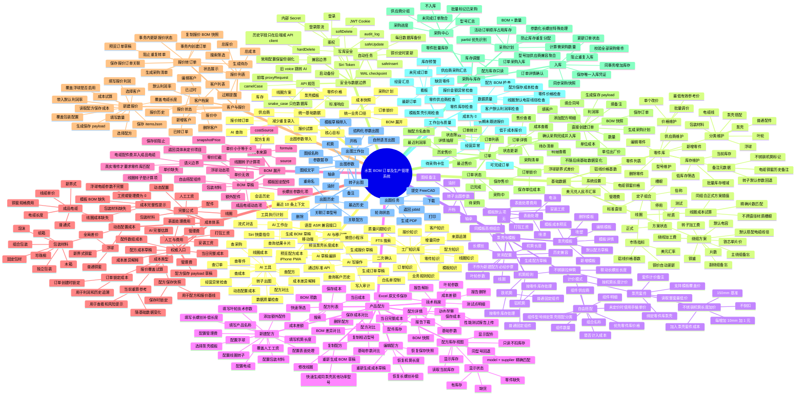

# 水泵 BOM 管理系统业务逻辑脑图

> 基于当前项目文档、页面导航和 API 路由梳理，更新于 2026-07-24。

```mermaid
mindmap
  root((水泵 BOM 订单及生产管理系统))
    核心目标
      统一基础数据
        零件价格
        供应商
        库存
        线圈方案
        泵壳模板
      统一业务口径
        BOM 展开
        成本快照
        报价试算
        订单锁价
        采购计划
      减少重复录入
        配方复用
        报价转订单
        AI 查询
        出图参数带入
    基础数据
      零件库
        零件列表
        新增零件
        编辑零件
        删除零件
        型号维护
        分类维护
          泵壳
          泵壳搭配
          电缆线
          浮球
          包装材料
          叶轮
          普通配件
        供应商维护
        价格维护
          单个改价
          批量调价
          最低有效参考价
        库存维护
          当前库存
          低库存筛选
          批量库存增减
        备注元数据
          不锈钢机筒标记
          电缆铜套历史备注
          转子默认参数回退
      线圈
        定子组合
          标准直径
          俗称
          材质
          槽眼
        绕组方案
          片数
          铁芯单片价
          铜重
          绕线加工费
          转子加工费
          默认搭配电缆线径
          默认电容
          主绕组备忘
          副绕组备忘
        方案状态
          正式
          测试
          停用
        线圈成本试算
          精确片数匹配
          同组合正式方案插值
          不跨直径材质槽眼
        市场指标
          铜价自动更新
          铝线价格基数
          美元汇率
      系统设置
        管理费
        电缆铜套价格
        浮球新界式差价
        铝线价格基数
        美元兑人民币汇率
    泵壳与模板
      泵壳模板
        新增模板
        编辑模板
        删除模板
        模板详情
        模板成本预览
        默认配方草稿
      计价模式
        泵壳套件
          绑定零件库泵壳
          读取整套最低价
          支持模板覆盖价
          套件计价备注
          不锈钢机筒长度加价
            150mm 基准
            每增加 10mm 加 1 元
            不倒扣
            加入泵壳套件成本
        自由搭配
          组合名称
          组件明细
          组件型号绑定泵壳搭配分类
          组件供应商
          组件数量
          是否计入成本
          优先零件库价格
          未定价时使用手输单价
      机筒规则
        铝机筒
          普通固定组件
          按零件库存处理
        不锈钢拉伸筒
          按机筒长度计价
          联动长螺丝长度
        铁机筒
          普通固定组件
          按零件库存处理
      模板默认项
        安装工资
        打包工资
        表面处理
          无
          喷漆
          电泳
          喷塑
        表面处理费用
        转子出图参数
          轴承
          油封
          开档
          图纸备注
      常用配置
        历史兼容
        同模板高频组合
        线圈
        机筒长度
        长螺丝
        叶轮参数
        生成配方草稿
        不作为新建配方必经步骤
    产品配方
      配方列表
        搜索
        快速筛选
        保存成本
        当日成本
        成本差额
        BOM 项数
      新建配方
        选择泵壳模板
        填写产品名称
        配置线圈转子
        配置浮球
        配置电缆
        添加额外配件
        配置包装材料
        覆盖人工工资
        配置表面处理
        配置管理费
        填写机筒长度
        填写长螺丝补偿长度
        填写叶轮技术参数
      编辑配方
        恢复保存快照
        恢复机筒长度
        恢复长螺丝补偿
        重新生成 BOM 草稿
        重新生成成本草稿
      复制配方
        复制相近型号
        修改线圈
        快速生成同泵壳其他功率型号
      删除配方
      配方详情
        基础参数
        动态配置
        BOM 快照
        保存成本
        当日完整成本
        成本差额
        配件库存
      配方对比
        基础参数对比
        保存成本对比
        BOM 差异对比
      技术档案
        叶轮参数
        性能测试报告上传
        Excel 原文件保存
        报告解析
        测试点明细
        报告删除
        报告下载
      配方库存视图
        读取当前库存
        model + supplier 精确匹配
        同型号回退
        显示配件
        显示库存
        显示状态
          有库存
          缺货
          零件缺失
        只读不扣库存
    BOM 展开
      BOM 草稿
        模板固定配件
        自由搭配组件
        线圈转子计算项
        浮球动态项
        成品电缆动态项
        包装材料
        额外配件
        长螺丝参数化项
      成本来源
        snapshotPrice
        costSource
        source
        formula
      零价拦截
        单价缺失
        单价无效
        单价小于等于 0
        保存前阻止
        返回具体未定价项目
      语义边界
        线圈转子是计算项
        电缆配件费并入成品电缆
        真实零件才要求零件库匹配
    成本体系
      完整公式
        配件
        线圈
        动态配置
        人工工资
        包装材料
        管理费
      成本类型
        当前重算参考
          随基础数据变化
          用于查看和风险提示
        配方保存快照
          保存时锁定
          用于配方和报价基线
        订单锁定成本
          订单创建时锁定
          用于利润和历史追溯
      权威入口
        配件数组成本
        配方成本草稿
        配方保存 payload 草稿
        报价覆盖试算
        当日完整成本
        AI 完整估算
        成本差异解释
      动态配置成本
        浮球
          普通铜套
          新界式铜套
          全局差价
        成品电缆
          线缆单价
          电缆长度
          铜套规格费用
          新界式
          普通式
        包装材料
          独立包装
          组合包装
          纸箱
          木箱
          泡沫
          珍珠棉
          固定包材
      人工与费用
        安装工资
        打包工资
        表面处理费用
        管理费
      成本完整性提示
        模板 BOM 缺失
        线圈成本缺失
        浮球电缆参数不完整
        包装材料缺失
        工资或管理费为 0
    客户与报价
      客户档案
        客户列表
        新增客户
        编辑客户
        删除客户
        默认利润率
        报价历史
      报价列表
        搜索筛选
        状态展示
        总成本
        总报价
        过期提醒
      新建报价
        选择客户
        带入默认利润率
        选择配方
        读取配方保存成本
        填写数量
        填写报价利润
        覆盖浮球是否启用
        覆盖电缆长度
        覆盖包装配置
        成本试算
        生成保存 payload
        保存 itemsJson
      报价状态
        报价中
        已过时
        已转订单
      报价转订单
        预览订单草稿
        复制报价 BOM 快照
        生成采购清单
        生成待办
        事务内创建订单
        保存报价订单关联
        事务内更新报价状态
        阻止重复转单
    订单
      订单列表
        状态筛选
        订单统计
        详情抽屉
      直接创建订单
        填客户
        填合同号
        填备注
        添加配方明细
        数量
        单位成本
        利润率
        单位出厂价
        BOM 快照
        生成采购计划
        生成保存 payload
        保存订单
      订单详情
        明细查看
        成本查看
        售价查看
        采购清单
        待办清单
        状态更新
        确认采购完成并入库
      订单状态
        待采购
        采购中
        已完成
      订单锁价
        保存单位成本
        保存售价
        不随后续基础数据变化
      历史售价
        按配方名查询
        最近售价
        最近利润率
    采购与库存
      采购计划
        BOM × 数量
        partId 优先识别
        型号加供应商兼容聚合
        活动订单顺序占用库存
        防止库存重复分配
        计算需采购数量
        参数化长螺丝特殊处理
      采购中心
        未完成订单聚合
        供应商分组
        型号汇总
        采购进度
        批量标记已采购
        不入库
      入库
        订单详情确认
        校验全部采购零件
        同事务增加库存
        同步采购快照
        更新订单状态
        保存唯一入库凭证
        阻止重复入库
      库存调整
        零件批量库存
        订单采购入库
        配方库存只读
    工作台与质量
      看板
        经营汇总
        未完成订单
        库存预警
        供应商采购汇总
        最新订单
        缺货零件
      数据质量
        零件价格检查
        零件供应商检查
        零件库存检查
        配方 BOM 检查
        配方保存成本检查
        模板泵壳引用检查
        线圈默认电容线径检查
        客户默认利润率检查
        报价金额异常检查
      经营异常
        长期未跟进报价
        低于成本报价
        成本为 0
        待采购卡住
        可完成订单
    转子出图
      出图工作台
        结构化参数出图
        自然语言出图
        模板草稿带入
        参数暂存
      出图参数
        图纸名称
        图纸文字
        轴承
        油封
        开档
        机筒
        备注
      出图任务
        提交 FreeCAD
        返回 jobId
        轮询状态
        生成 PDF
        下载
        打印
      出图历史
        最近历史
        重命名
        删除
        关联订单型号
        关联配方
    AI 与移动端
      AI 工作台
        流式对话
        工具执行计划
        查询结果卡片
        会话历史
        最近 10 条上下文
      AI 工具
        查配方
        查成本
        查零件
        查订单
        查采购
        线圈成本
        动态配置成本
        配方对比
        成本差异解释
        数据质量检查
        经营异常检查
        转子出图
      AI 草稿编排
        生成 BOM 草稿
        预览配方成本
        预览泵壳长度成本
        生成报价草稿
        生成订单草稿
        查询客户历史
      AI 写操作
        白名单控制
        二次确认
        通过标准 API
        写入审计
      工厂知识库
        零件知识
        模板知识
        配方知识
        线圈知识
        客户知识
        报价知识
        订单知识
        质量问题知识
        业务规则知识
        增量同步
        FTS 搜索
        来源追溯
      移动端
        iPhone PWA
        微信小程序
        Siri 快捷指令
        语音 ASR 兼容接口
    安全与数据边界
      鉴权
        登录
        JWT Cookie
        内部 Secret
        Siri Token
        登录限流
      写库安全
        safeInsert
        safeUpdate
        softDelete
        hardDelete
        audit_log
      API 规范
        标准响应
        camelCase
        snake_case 只在数据库
        前端 proxyRequest
      自动任务
        启动备份
        每日数据库备份
        WAL checkpoint
        铜价定时更新
      兼容边界
        历史字段只在后端或 API client
        旧 voice 跳转 AI
        常用配置保留但弱化
```
